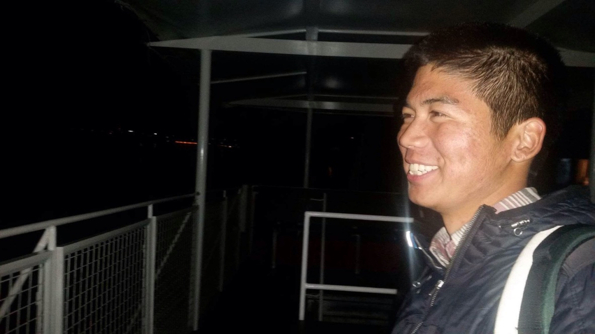

After Belgium, I spent one night in Prague and took a bus to Hungary the next morning. I stayed in Budapest for 10 days with Eszter, the Hungarian woman I had a crush on at the beginning of this whole adventure.

It felt strange, to be back in the swing of normalcy, as if such a thing was possible after such a journey.

There was no bitterness or resentment toward Marieke. Actually, I was alarmed at how fast it seemed I was “moving on”. It was as if my mind had compartmentalized the Camino experience, like it was all some dream I had just awoken from.

When I ws with Eszter, it felt like nothing had changed. We talked with the same depth and intensity we had in Canada, and I seemed to be living and acting like a normal human being. The feelings I had for her were still there too, which surprised me. Was I already losing the Camino?

The fact that it was over didn't hit me until I was home in California on October 26th, 2017. A teary-eyed Mother was waiting for me in LAX. She said I looked like a tan monk. We went home. I hugged my Dad and my brother. I shared brief stories of my experience, then went to bed.

Over the next few days, I fell into a state of deep loneliness, despondence, and longing. My friends and parents tried to soothe my grievances, but they couldn't. How could they? I was falling into a hole that simply didn't exist in their world. "You're home now. Shouldn't you be happy?"

A few days later, it became clear to me that I missed life on the road. But why? What was it that I missed? The simplicity? The friendships? The solitude? The clarity? A sense of purpose? Purpose.

I was doing it all wrong. I was trying too hard to return to a place in my mind that was concrete and grounded; trying too hard to refit my life into the straitjacket I had fought so hard to escape from.

Purpose: I had searched the Camino for such a thing, but never found it. Only when I had abandoned my search and surrendered the idea that I could control each and every ounce of my life, did I finally understand what was worth living for: growth, and love. 

In some sense, these things are also a form of purpose, and perhaps that is the great paradox: we continually strive for meaning when nothing really matters in the grand scheme of things. Perhaps that is what keeps us going – we get to decide what matters and what doesn't.

Purpose is what keeps us afloat in our day to day, year to year existence until the moment we take our final breath. But life only matters, to paraphrase David Foster Wallace, before that final breath. It is here that we have our greatest opportunity: we get to choose what is and isn't meaningful to us, what's worth and not worth fighting for. Although the grand stage is, in some ways, already set, we get to decide within the parameters of these rules how we want to play the game. And the wonderful thing is, these rules are flexible.

I suppose then I wasn't ready to decide yet, what was and wasn't worth dedicating my time and attention to, and I had to be fine with that. I had to be fine with sitting alone in the unknown, as terrifying as it is at times. What helped was realizing that it is more terrifying to latch onto a purpose not designed and chosen by you.

The world around me had not changed. It was I who felt displaced, dislodged, different. I recognized it in the way I perceived things, in the way I talked with my friends, in the way I thought about time. I could feel it in the growing distance between who I thought I was, and who I was becoming. Only once I had accepted that I had fundamentally changed, that I had grown, did I begin to find a sense of Home again.

Home isn't really about a place or its inhabitants. Home begins and grows from the inner wellspring of one's being. In a sense then, home truly is where the heart is. Home is a landscape we carve from the varieties of experience that so happen to grace us.

 

I am reminded of a quote by Joanna Field:

> “I did not know that I could only get the most out of life by giving myself up to it.”

That feeling I had in Santiago –– of wholeness, interconnectedness, fluidity, shapelessness, of being something outside of myself –– it didn't last long, but something in me had shifted.

The world feels more beautiful. Perspective is easier to hold and maintain. The everyday is less mundane and more majestic. Little things don't bother me as much. Peace and contentment are more accessible.

Of course, I will still have my bad days and mood swings. I will still have my moments of doubt and paralysis when the grip of the darker depths of my mind take hold, moments when I am unable to see the light gleaming over the horizon.

But I know now it is always possible to get out, to surrender, to let go and be still, to feel what I feel without attachment, to be impermanent, to be.

This moment. This beautiful, precious, seamless moment. This is it.

