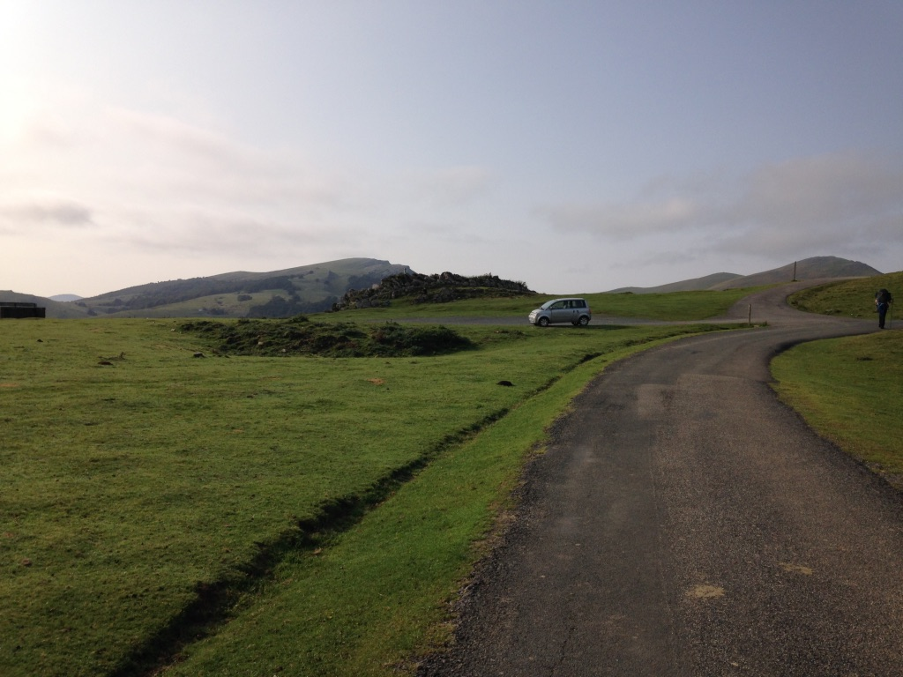

I woke to the sound of creaking bunk beds, rustling backpacks, and hushed chatter. 5:30 a.m. _Time to go._ I put my boots on, packed my sleeping bag, and went downstairs.

Small talk of good weather and stellar walking conditions and free bread as stiff as stones. I devour as much of it as my mouth can muster and head out.

The first day was supposed to be arduous: 27 kilometers from Saint-Jean to Roncesvalles, with a gradual gain of 1400 meters in elevation. It was dark, cold, and misty out. Regardless, I equip myself with a smile, shoulder my rucksack, and begin putting one foot in front of the other.

For most of the morning I walk along a narrow road populated by small farms and modest homes. A constant stream of white vans drives by, presumably transporting those who are daunted by the unavoidable ascent over the Pyrenees, or those who are physically incapable. The air stinks of manure and wheat, though I felt invigorated by a sense of new beginnings.

After 5-6 kilometers of walking in the twilight, I reach the base of the Pyrenees. I allow myself a short break, then began the ascent. As I climb higher into the sky, the sun is rising to fulfill its daily task. Clumps of green become discernible blades of grass, darkness turns to shadow, cowbells and birdsong fill the air. The landscape is awakening.

The sheer variety of walkers amazes me. Young and old; American and Canadian, English and Irish; German, Hungarian, Italian, Polish; Korean, Japanese… the list is endless.

It's easy to discern those who are on vacation from those who are in search of something greater. The vacationers often walked in couples or groups. Their conversations were light, suffering was a force to be avoided, they lacked a spiritual connection to the Camino. Conversely, the seekers usually walked alone. They connected with other soloists and seekers, their suffering was meaningful, the Camino had called to them.

Of course, these are only superficial observations. A person could be walking for deeply personal reasons, but had decided to go with others because they are simply terrified of walking alone. And certainly there's the spiritual bunch who act like hound dogs on a life-or-death mission; they're the ones who often lose sight of the very thing they're seeking - it was often right under their noses.

I arrive at Refuge Orisson two hours later, an albergue about 8 kilometers west of Saint-Jean. I take a break and buy myself another round of breakfast – espresso with a Spanish tortilla. The mountainous air feels cool and refreshing, the views from the terrace are stunning. I fill my lungs and exhale slowly.

Back on the road, I am greeted by a cheery social worker from South Korea named San. He doesn’t speak much English, but when he does, it's usually about someting positive, and he always laughs at my jokes.

We meet another South Korean named Jackie moments later. She worked in hospitality for a year before deciding that she was dissatisfied with her life. She's a seeker, and unlike San, her English is fluent. She understands my jokes but doesn’t laugh at them the way San does. Regardless, we welcome her company and walk together for the next two hours.

Solitude exists only in stolen moments during the early stages of the Camino. San and Jackie need a break, so I continue on without them, knowing that we will reconnect in Roncesvalles.

A continual stream of other pilgrims takes their place. It's overwhelming at times, all the 'Buen Caminos!' and fleeting conversations. I appreciated their earnest attempts to connect, but often I wanted to be alone with the scenary. That was something I was still trying to learn: how to accept and be open to the unexpected company of others.

I arrive at Roncesvalles early in the afternoon. It’s a small town with two restaurant-bars, a hotel, and a gothic monastery that accommodates 200 or so pilgrims. After checking in, I idle in the courtyard, call my parents, and write in my journal. Later, Jackie and I grab a drink at the local bar to celebrate our first full day of walking. Afterwards we go to the nearby restaurant for dinner with some of the other pilgrims. 

The standard pilgrim meal consists of an appetizer, the main dish, and dessert, of which was always accompanied by a bottle of red wine. Always. By the end of the night our tongues were loose, and we began exchanging stories of who we were, where we came from, and why we were walking the Camino.

The Spanish couple at our table had recently returned to Spain after having lived in London for several years, stating that life in the city was too complicated. They preferred the simple lifestyle of Spain, and they were walking the Camino to celebrate their homecoming. Another man from Italy shares that he has been walking the Camino every year for the past five years. He liked the perspective he gained and the people he met. 

“Everyone has a story to share on the Camino. I come here to learn and listen,” he said.

After dinner, I retreat to my bunk bed and journal about the day.

Walking in unknown territory nourished me. I felt alive and powerful, small and humbled beneath the Spanish skies. Perhaps I was here to write the rest of my own story; to rediscover and map the terrain of my own heart.

I check the contents of my rucksack again. Three outfits and two pairs of socks. A sleeping bag and a down jacket. Phone charger, toiletries, another set of shoes in addition to my boots. Just in case.

Emergency medical supplies for three days. The KIND bars have been shared and devoured; my 1-liter nalgene bottle is filled to the brim. My California license plate––the only item of sentimental value. A journal and my writing tools.

I take a deep breath.

Excitement. 

I let it go, slowly.

They’re two sides of the same coin, and I am standing on the precipice.

