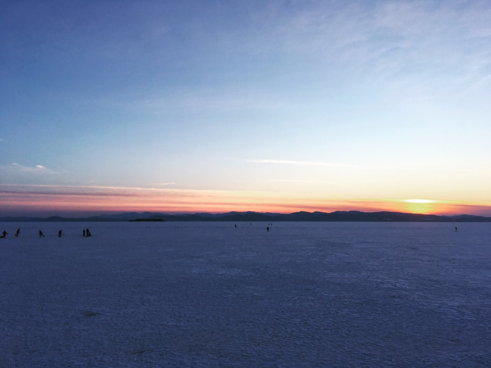

I ventured out onto the lake today, this time beyond the frozen crest that marks the boundary between bay and lake, contemplating the last line of Maria Popova’s Figuring: “What will survive of us are shoreless seeds and stardust.” My saunter figured into a sprint as the mountains came into view, and soon the voices behind me were no more than whispers. Minutes later I ran into a couple playing in the snow. We were the only three out on the edge of the lake’s center, three constellating islands happy just to be. I smiled at them and carried on ahead.

The ski tracks and foot trails slowly gave way to the unsentimental forces of snow and wind, erasing, leaving behind no trace of human curiosity, ingenuity, legacy, as I moved further from civilization. I reached the center and turned my gaze toward shore, then to the skies above.

The fact that, by some collision of chance and choice, we exist in this cosmic blink of a moment, so short yet so sweet, should give us pause.

Standing on the expanse, alone though filled with images of another, alone yet accompanied by the unique neuronal flutterings that have mapped onto my brain the contours of a newly discovered body and mind, I thought of how easy it would have been to ascribe my good fortune to the whims of an all powerful force. This beautiful impulse toward certitude is a defining feature of our species.

But then I took a breath and remembered there exists a narrative more compelling than man-made stories predicated on fear of the afterlife. One only has to look up at the stars. “What will survive of us are shoreless seeds and stardust.” One day we will close our eyes for the final time, and return to that space from which we all came, forever constellating and transmuting, forming and reforming, dancing and figuring on the thread of eternity.

